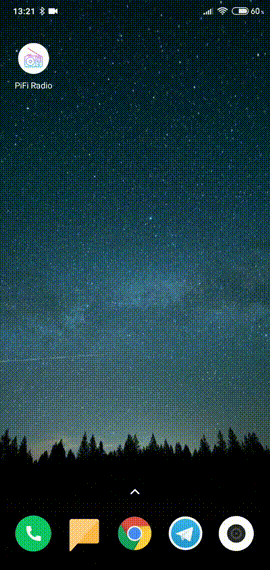

# PiFi Radio

PiFi Radio: A MPD web client to listen to radio

## Table of contents
* [Meet PiFi Radio](#meet-pifi-radio)
   * [What is PiFi Radio](#what-is-pifi-radio)
   * [Some features](#some-features)
   * [Demo](#demo)
* [Installation](#installation)
* [Configuration](#configuration)
   * [PiFi configuration](#pifi-configuration)
   * [List of streams](#list-of-streams)
* [Credits](#credits)
* [License](#license)

## Meet PiFi Radio

### What is PiFi Radio

PiFi Radio is a minimalist MPD web client to listen to radio. In other words, it makes your Raspberry Pi play Internet radio, while you control from any device, such as your phone.

As PiFi is just an interface for MPD, it has some advantages compared to other solutions, e.g. bluetooth or AirPlay. For example, the radio playback is completely independent from your phone. You can take calls, play videos, go to an area with poor WiFi signal, or even turn off your phone. Your Pi will still continue to play the radio you picked.

[I started this project in early 2017. At that time, I wanted to configure Raspbian so my parents could listen to radio with ease, but couldn't find any good solution to it.](https://rafaelc.org/blog/the-motivation-for-pifi-radio/)

Some of the goals of PiFi Radio were the following:

- Easy for my parents to use.

- Simple, straight-forward interface. Do the few things they need and in a clear way.

- As fool-proof as possible. Don't show unnecessary options, minimize user interaction and try to predict what they want.

- Display both available and current stations clearly. No URLs or weird names.

- Multi-platform, targeting primarily mobile phones.

- In local language.

### Some features

Although PiFi tries to be minimal, there are some neat features, such as:

- Organize the radios in categories, if you wish.

- Select some radios to be shown only to certain IPs.

- Paste a streaming URL to PiFi directly from your web browser. Useful if you want to listen to a radio that was not previously added to the list.

- Add it to your phone home screen.

- Multiple people can use it at the same time.

- PiFi has two views [(the List of Radios and Playback Controls)](#demo). It tries to show each one smartly so you tap less. For example, when you open PiFi and MPD is idle, the list of radios is shown, because you probably want to pick a station.

- If by mistake you choose the same station that is currently playing, the playback continues as if nothing happened.

- PiFi is currently available in a few languages, and it's easy to translate to more.

Besides radio, there is the "Random" button:

- By request, I added a button to play random music from the MPD library. That's the "Random" button. Tapping it plays all your music in shuffle mode. To skip the current song, just press it again.

- That's the only library function available on this app. Think of that as a bonus. Library support is an after-thought on PiFi, and not its main purpose. [You can disable this button in the configuration.](#pifi-configuration)

## Demo

## Installation

While PiFi was imagined for the Pi, it should run on any computer with:

- Ruby and a few gems
- MPD

[Check the installation guide](INSTALL.md).

## Configuration

### PiFi configuration

Configuration is read from the JSON file at `/etc/pifi-radio.conf`. These are the options:

| Key             | Value
| --------------- | -------------------------------------------------------------------------
| `cache_max_age` | Cache value used by Rack.
| `serve_static`  | If Rack should serve static resources. Set to `false` if your web server is already doing it.
| `host`		  | MPD host.
| `port`		  | MPD port.
| `streams_file`  | Path to file containing the streams list [(see next section)](#list-of-streams).
| `streamsp_file` | Path to other file containing streams list. The stations here will be merged with the other list and presented only to devices which IPs are listed on `special_ips`. A use case for this is if you have tons of stations that only you listen and you don’t want to pollute everyone else's list. *(If you don’t need this, just leave it empty.)*
| `special_ips`   | The IPs for which the additional streams will be shown. *(If you don’t need this, just leave it empty.)*
| `play_local`    | If you don’t want PiFi to play songs from your local library, set it as `false`. This will remove the "Random" button.

### List of streams

To keep it simple, the list of streams is just a JSON file with key-value pairs, where the key is the station name, and the value is the streaming URL. For example:

    {
         "Radio 1": "https://example.com/radio1",
         "Radio 2": "https://example.com/radio"
    }

If you want to arrange the stations in categories, add a pair with the category name, and empty value, as in:

    {
         "Talk radio": "",
         "Radio 1": "https://example.com/radio1",
         "Radio 2": "https://example.com/radio2"

         "Classical": "",
         "Radio 3": "https://example.com/radio3",
         "Radio 4": "https://example.com/radio4"
    }

This will add the headers "Talk radio" and "Classical" above each block of stations, [identical to "Spain" in the demo](#demo).

## Credits

* French translation: Francis Chavanon "rimeno"
* Icon made by [iconixar](https://www.flaticon.com/authors/iconixar) from [www.flaticon.com](https://www.flaticon.com/), licensed by [Flaticon Basic License](app/icon/license.pdf).

## License

Released under [GNU GPL v3](LICENSE).

Copyright 2017-2019 Rafael Cavalcanti <hi@rafaelc.org>

